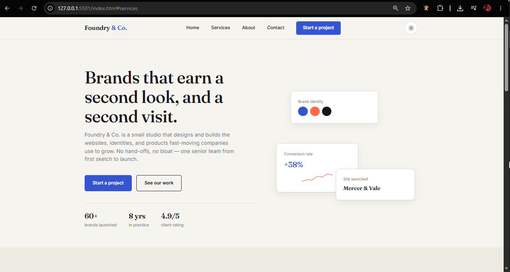
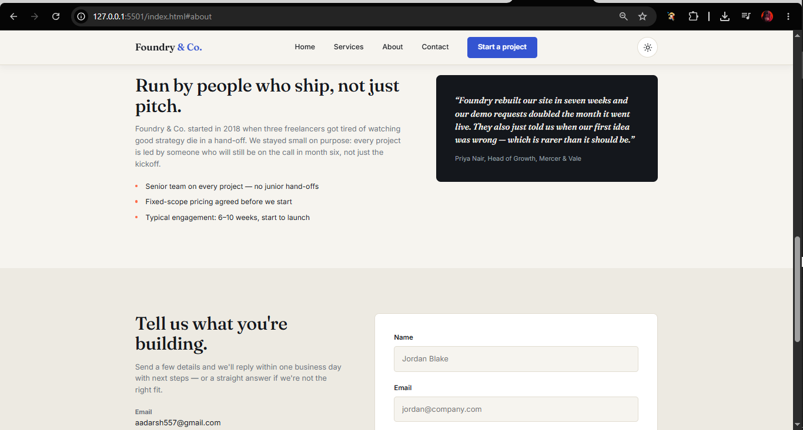
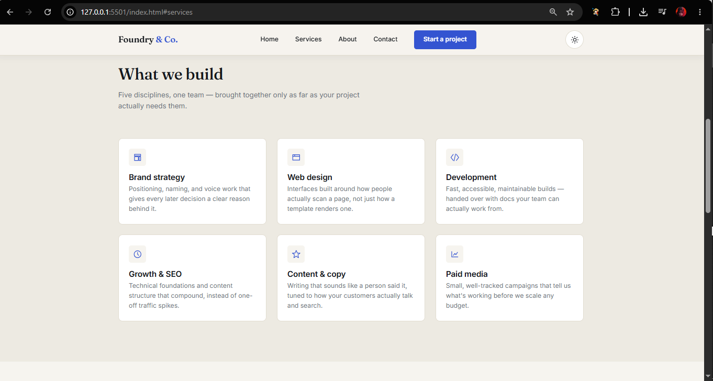
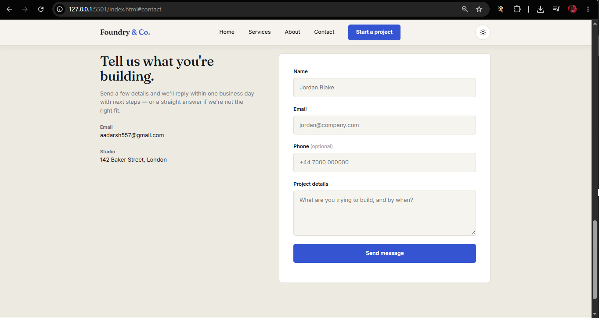

# Foundry & Co. — Responsive Business Landing Page

## Project Overview

Foundry & Co. is a modern fictional **digital agency landing page** created as part of **Task 2: Responsive Business Landing Page**.

The website focuses on clear branding, responsive design, easy navigation, and strong calls-to-action.

## Features

* Responsive design for desktop, tablet, and mobile
* Professional navigation with Home, Services, About, and Contact
* Hero section with business value proposition and CTA buttons
* Six service cards
* About and client testimonial section
* Contact form with validation
* Mobile hamburger navigation
* Light/dark theme toggle
* Sticky navigation effect
* Accessible and touch-friendly interface

The navigation, hero, services, and contact sections are implemented in the main HTML structure.

## Technologies Used

* HTML5
* CSS3
* JavaScript
* Google Fonts
* SVG Icons
* Local Storage

## Responsive Design

The layout adapts to smaller screens by:

* Switching to a mobile navigation menu
* Stacking content vertically
* Scaling visual elements
* Maintaining readable typography
* Keeping buttons and form controls touch-friendly

The JavaScript handles the mobile menu and form validation.

## Project Structure

```text
project/
├── index.html
├── styles.css
├── script.js
├── assets
|   ├── hero_.png
|   ├── contact.png
|   ├── mobile2.0.png
|   ├── mobile.png
|   ├── service.png
|   └──landing.png
└── Readme
```

## Screenshots

The submission should include:

* Full desktop landing page
  
  
* Mobile hero section
  
  

* Services section
  
  

* Contact form
  
  

## 🚀 Live Demo

[🌐 View Live Website](https://businesslandingpg.vercel.app)
